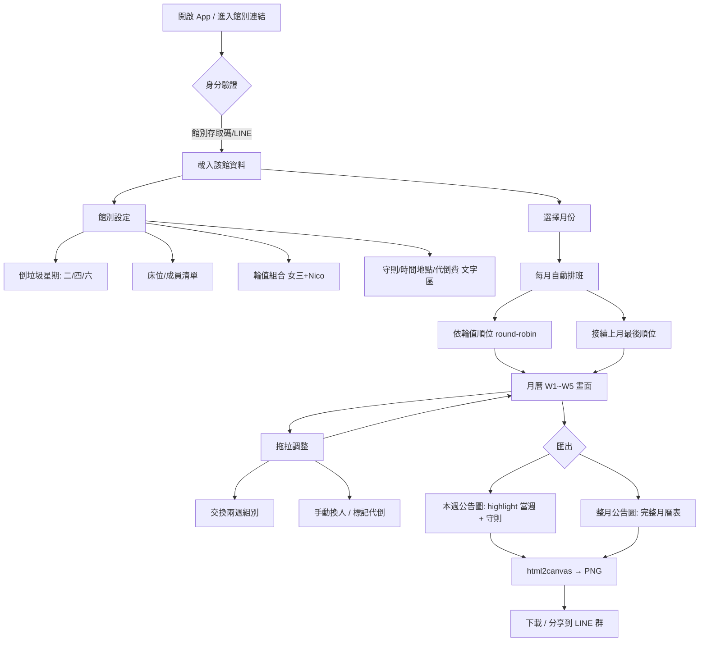

# 垃圾回收輪值排班系統 — 初步計畫

> 狀態：規劃中（待 review）｜最後更新 2026-06-06
> 定位：手機優先 SPA，給各館小幫手安排每月倒垃圾輪值

---

## 0. 已確認的決定

| 項目 | 決定 |
|---|---|
| 資料儲存 | **接 Supabase 雲端**（沿用現有 BMS 的 Supabase 專案） |
| 使用者 | **總管 + 各館小幫手**；總管可指派誰能看/管哪些館 |
| 匯出版型 | **MVP 先求能匯出**，版型細節之後再美化 |
| 匯出比例 | **3:4 直式**（手機友善） |
| 週起點 | **星期一**（對齊參考圖） |
| 倒垃圾日 | 二/四/六 **僅顯示**，不做逐日打勾複查 |
| 定位 | **獨立小工具**，不併進 BMS 入口 |

---

## 1. 核心模型（從兩張參考圖歸納）

通用單位：**「一週 = 指派給一個輪值組（1~N 個床位）」**
各館差異只在三件事：

1. 倒垃圾是星期幾（古亭2館=二/四/六；民生館=一/二/四/六）
2. 一組幾個人（單床位 or `女三+Nico` 這種組合）
3. 輪值順序如何跨月延續

---

## 2. 系統流程圖



---

## 3. 資料模型（Supabase tables）

```sql
buildings           館
  id, name, duty_weekdays int[]  -- [2,4,6]
  rules_text, times_text, locations_text, sub_fee
  rotation_anchor    -- 記錄輪值延續起點

members             床位/成員
  id, building_id, label, sort_order, active

rotation_groups     輪值組 (女三+Nico)
  id, building_id, name, order_index

group_members       組↔成員 多對多
  group_id, member_id

schedules           月排班
  id, building_id, year, month

schedule_weeks       每週指派
  id, schedule_id, week_index(W1..W5)
  group_id            -- 自動或拖拉後的結果
  is_locked           -- 手動鎖定不被重排覆蓋
  note                -- 代倒/換班備註
```

---

## 4. 權限（總管 + 各館小幫手）

需要真正的帳號（因為總管要指派誰能看哪些館），不能只靠分享碼。

**角色**
- `super_admin`（總管）：看/管全部館；新增成員、指派館別授權。
- `helper`（小幫手）：只看/管被指派到的館。

**授權表**
```sql
app_users         id, name, role(super_admin|helper), auth_uid
building_access   user_id, building_id        -- 多對多：誰能管哪些館
```

**登入方式**：**Supabase Auth — Email 密碼 / Magic Link**（不依賴 LINE，設定最快）。
- `app_users.auth_uid` 對應 Supabase Auth 的使用者。
- 總管在後台建立小幫手帳號並指派館別；小幫手收信/登入後只看到自己的館。

**Supabase RLS**：每筆 buildings/schedules 讀寫都檢查 `building_access`；super_admin 全開。

---

## 5. 自動排班邏輯

```
輸入: 該館 rotation_groups（已排好 order_index）、目標年月、上月最後使用到的順位
流程:
  1. 算出該月有幾個「週列」(W1..W5，對齊星期一起算)
  2. 從上月延續的下一個 order_index 開始
  3. round-robin 把 groups 依序填入每一週
  4. 已 is_locked 的週跳過、不覆寫
輸出: schedule_weeks
```

拖拉：交換兩週的 `group_id`；被拖過的週自動 `is_locked=true`（避免重排被洗掉）。

---

## 6. 畫面（手機優先）

1. **館別首頁** — 本月月曆 + 本週是誰（大字 highlight）
2. **月曆編輯** — W1~W5 直列，每列一張組別卡，可上下拖拉/交換
3. **館別設定** — 床位清單、輪值組、倒垃圾星期、守則文字
4. **匯出** — [本週圖] / [整月圖] 兩顆按鈕 → **3:4 直式** PNG 下載 / 分享
   （畫布固定 3:4，如 1080×1440；html2canvas 以 scale 提升清晰度）

> 角色入口：總管多一個「成員與館別授權」管理頁；小幫手登入後只看到被授權的館。

---

## 7. 開發階段（建議）

- **P0 MVP**：單館、自動排班 + 拖拉 + 整月匯出（localStorage 先跑通畫面）
- **P1**：接 Supabase、多館、access_code 權限
- **P2**：本週圖 + 整月圖兩種版型美化、跨月延續、代倒標記
- **P3**：LINE 分享 / 週六自動提醒隔週名單

---

## 8. 已定案（前次確認）

- ✅ 有總管角色，可指派誰看/管哪些館 → 真帳號 + `building_access` 授權表
- ✅ 週起點 = 星期一
- ✅ 倒垃圾日僅顯示，不打勾複查
- ✅ 匯出 3:4 直式
- ✅ 獨立小工具，不併 BMS

- ✅ 登入 = Supabase Auth（Email 密碼 / Magic Link）

→ 規劃決策全部定案，可進 P0。
```
